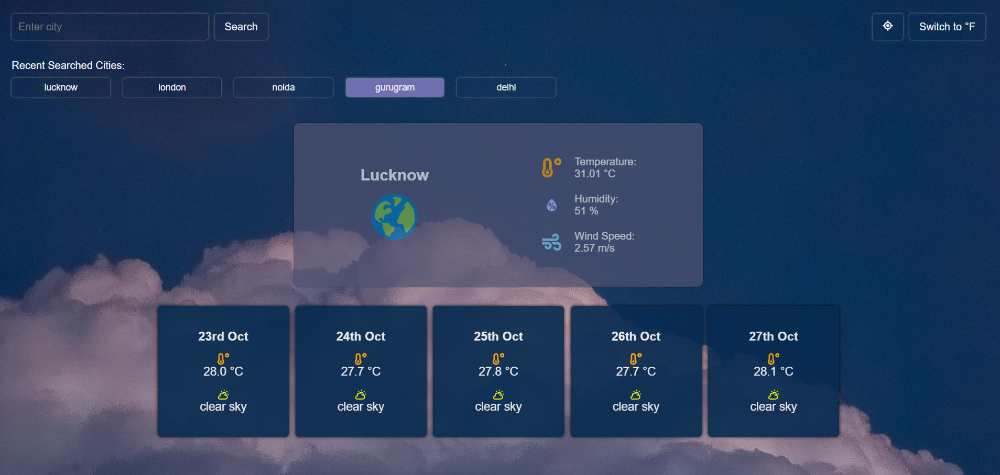
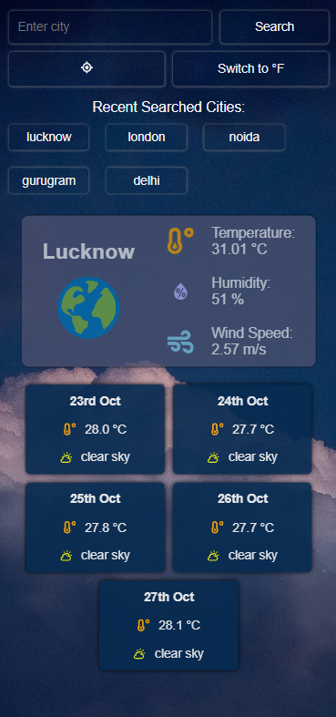

# Weather Dashboard App
This is a responsive weather dashboard application built with React and CSS3, designed to provide users with real-time weather information for cities worldwide. The app retrieves data from the Open-Meteo API and displays detailed weather information such as temperature, humidity, wind speed, and a 5-day forecast.

# Technologies Used
React: Frontend framework for building user interfaces.
CSS3: For responsive styling and layout.
JavaScript (ES6+): To handle API calls and dynamic behavior.
Open-Weather API: To retrieve real-time weather data.
Local Storage: To save and retrieve the user's last searched cities.
HTML5: Markup language for structure.
